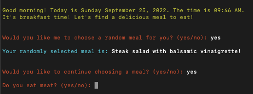
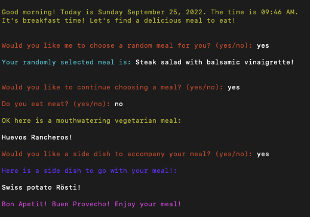
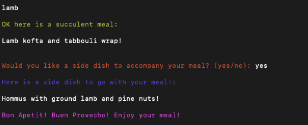

# Meal Decider

[Link to Github repository](https://github.com/beatsnob/terminal.app)  

[Link to Trello board](https://trello.com/b/oJlvboIs/terminal-application)

## Purpose and design
---

One evening, during which I was regularly opening and closing my fridge with the hope that something edible would just magically appear made out of the ingredients in there, I thought to myself "wouldn't it be great if there was something that could decide a meal for me?" - and thus, the Meal Decider was born.  
The purpose of this application is to provide meal suggestions for people who for some reason or another cannot think of what to eat for breakfast, lunch or dinner. The application is designed to greet the user based on the time of day and recieve input from the user regarding dietary preferences (vegetarian or non-vegetarian, protein choice, etc.) and provide output depending on these choices. The application will also provide the option to generate a random recipe from the database. This application adheres to the PEP8 style guide for python code which can be found here: [PEP 8 style guide](https://peps.python.org/pep-0008/).

## Features
---

This application is simple in its design and use - it takes user input regarding their dietary preference (vegetarian or meat based meals) chiefly in the form of 'yes' or 'no' responses and produces a meal suggestion based on the current local time of day (a breakfast, lunch or dinner meal). The features of this application are as follows:

* The application opens with a greeting based on the current local date and time with a short message on getting started - this is achieved using the datetime python module.
  
  
  
* The application asks whether the user would like the application to suggest a random meal - this feature does not take into account the dietary preferences of the user nor the local current time. The application does not specify whether the meal is a main, a side, breakfast, lunch or dinner. This feature will pull any of the meal objects from the imported JSON file and then ask the user whether they want to continue using the application. If the user selects 'yes' then the application will continue. If the user selects 'no' then the application will print a goodbye message.
  
  
  
* The application will check the current local time (morning, afternoon or evening) in order to determine the meal suggestion (breakfast, lunch or dinner), as well as checking the dietary preference that the user has selected. The preferences that the user can choose from are either vegetarian or meat based, with the protein choice question prompting the user to select from the following protein options: beef, lamb, chicken and seafood.  
  
  

* If the user selects 'no' they do not eat meat, the application will suggest a vegetarian based meal. The application has an additional feature that questions the user on whether they would like a side dish suggestion to go with their meal suggestion. This question comes after the main meal suggestion has been printed and the user can select either 'yes' or 'no' in response, with 'yes' printing out a side dish suggestion that conforms to the users dietary preferences along with the bon appetit message, while 'no' directly prints another version of the bon appetit message.
  
    
    
  user selects 'yes' to the side dish question
    
  user selects 'no' to the side dish question and is presented with the end message

* If the user selects 'yes' to the 'do you eat meat' question, the application will present four protein choice options for them to choose from:
  
    
  The user can choose any of these protein options by typing in the choice they select  
* The application will then take into account the user's choice of protein and suggest a meal based on this choice and the time of day - for example if the user selected 'lamb' as their chosen protein choice and it was lunch time, the application will suggest a lamb based lunch meal, provide a final bon apetit message and then end.
  
  

## Implementation Plan
---

In designing and implementing the features of this application, I utilised a kanban board on trello.com to create a break down of the plan into the individual steps that were required for completion. The use of the kanban board feature was extremely helpful in labelling and prioritising current and future steps to keep the workflow on track. The intuitive visual aspect of the board also allowed me to keep track of the steps I have completed, what was next and what was important. Click the image below to navigate to the Trello board.

[](https://trello.com/b/oJlvboIs/terminal-application)


## Testing  
---

Manual testing was designed and implemented around the three main features of the application: the opening time and date greeting, the random meal choice function and the meal suggestion based on user input choices. Additionally, a further test was conducted around the side dish suggestion function. The results are displayed in the following table:  

| Feature | Action performed | Expected outcome | Outcome |
| :---  | :---           | :---            | :---   |
|Greeting at initiation of the application code, greets user with the current date and time along with a message about getting started | Application was initiated and run from the beginning | Greeting to appear with correct local date and time along with getting started message | As expected
| Random meal suggestion is generated from the JSON file upon user choosing 'yes' in response to the random choice request | The response to the random choice request was 'yes' | A random meal suggestion regardless of current time and dietary preference | As expected
| A specific meal suggestion is generated based on user response to the dietary preference question and current time (morning, afternoon or evening) to output a time based main meal (Breakfast, lunch or dinner) | Response to the dietary preference question was 'no' in order to select a vegetarian meal suggestion | A vegetarian meal suggestion based on current time (lunch) | As expected
|A side dish suggestion based on current time, user dietary preference (vegetarian or user selected meat based), and choosing 'yes' in response to the side dish question | Response to side dish question was 'yes' and protein selected was 'beef' | A beef based side dish suggestion based on the current time (lunch) | As expected
|  
## Help Documentation
---  

Please note: This application requires the latest version of Python to be installed on your system - this can be found [here](https://www.python.org/downloads/) - follow the installation instructions according to your operating system.

1. Clone the application repository using the following command in your terminal:  

   ```bash
   git clone https://github.com/beatsnob/terminal.app.git
   ```

2. After cloning the application repository, navigate to the project folder and into the source code folder using the following command in your terminal:

    ```bash
   cd src
   ```

3. While in the src folder through your terminal, run the following command to install the relevant files to your system to get the application working correctly:

   ```bash
   pip3 install -r requirements.txt
   python3 ./main.py
   ```
   Alternatively you can run the following executable file directly from the src folder in the command line using this command:

   ```bash
   ./installer.sh
   ```
4. The application should now be running in your terminal - bon appetit, buen provecho and enjoy your meal!
